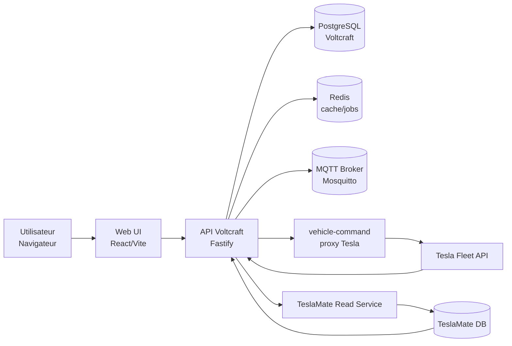

# Voltcraft

Voltcraft est une application web auto-hebergee pour piloter, superviser et historiser un vehicule Tesla avec une architecture locale et dockerisee. L'application privilegie la maitrise des appels Tesla Fleet API, le cache intelligent et l'exploitation locale sans SaaS obligatoire.

Tesla est une marque de Tesla, Inc. Voltcraft est un projet independant et non affilie a Tesla.

## Fonctions principales

- Tableau de bord temps reel avec etat compose du vehicule
- Commandes vehicule via Tesla Fleet API et proxy `vehicle-command`
- Historique trajets, charges, statistiques et diagnostics
- TeslaMate optionnel: stack locale (profile compose) ou instance externe
- Integration MQTT / Home Assistant
- Pression pneus (TPMS) exposee dans l'etat vehicule, visible sur dashboard et suivi sante
- Carte trajet avec heatmap conso ON/OFF et preference utilisateur persistante
- Navigation mobile optimisee en barre basse: 4 entrees + menu Plus
- Mode `AUTH_DISABLED` pour reverse proxy avec pre-authentification amont

## Architecture

Services principaux:
- `api` : backend Fastify qui sert aussi l'application web
- `db` : PostgreSQL principal Voltcraft
- `redis` : cache / coordination / BullMQ
- `mqtt` : broker Mosquitto pour integrations MQTT
- `vehicle-command` : proxy Tesla pour commandes signees
- `teslamate-*` : optionnels, uniquement si vous activez le profile `teslamate`

Schema de fonctionnement (vue d'ensemble):



Services TeslaMate (optionnels, profile `teslamate`):
- `teslamate`
- `teslamate-db`
- `teslamate-mqtt`
- `teslamate-grafana`

Definition complete des services: [docker-compose.yml](docker-compose.yml)

## Parcours recommande

1. Copier [.env.example](.env.example) vers `.env`
2. Renseigner les secrets de base et les ports souhaites
3. Lancer la stack Docker Compose (avec ou sans profile `teslamate`)
4. Ouvrir Voltcraft dans le navigateur
5. Completer l'assistant initial (OAuth Tesla facultatif)
6. Si TeslaMate est active, verifier la connectivite TeslaMate depuis l'interface Parametres

## Schema des donnees impacte

Le modele `vehicle_state_snapshots` inclut desormais les colonnes suivantes pour la pression pneus:

- `tpmsPressureFl`
- `tpmsPressureFr`
- `tpmsPressureRl`
- `tpmsPressureRr`

Ces champs alimentent:

- la carte `Pression pneus` du dashboard (derniere mesure)
- le bloc `Suivi pression pneus` dans la page Sante Vehicule (dernier echantillon + stats)

Le modele `user_settings` inclut aussi `tripHeatmapEnabled` pour persister l'affichage heatmap des trajets.

## Configuration Tesla

Voltcraft utilise actuellement une configuration Tesla basee sur OAuth applicatif.

Deux modes existent:
- `AUTH_DISABLED=true` : l'assistant initial saute la creation du compte admin local
- `AUTH_DISABLED=false` : l'assistant cree d'abord un compte admin local

Dans les deux modes, la configuration OAuth Tesla est maintenant facultative au setup.

La configuration Tesla peut etre mise a jour depuis l'interface Parametres. Le backend la persiste dans un fichier runtime (`APP_CONFIG_PATH`, par defaut `/app/data/runtime.env`) monte dans le volume `voltcraft-app-config`.

Champs Tesla principaux:
- `TESLA_CLIENT_ID`
- `TESLA_CLIENT_SECRET`
- `TESLA_REDIRECT_URI`
- `TESLA_REGION`
- `TESLA_COMMAND_PROXY_URL`

## Documentation

- Demarrage rapide: [QUICKSTART.md](QUICKSTART.md)
- Procedure d'exploitation et de deploiement: [DEPLOYMENT.md](DEPLOYMENT.md)
- Variables d'environnement: [.env.example](.env.example)

## Commandes utiles

Demarrage standard:

```bash
docker compose up -d
```

Demarrage avec stack TeslaMate locale:

```bash
docker compose --profile teslamate up -d
```

Mise a jour applicative:

```bash
git pull
docker compose up -d --build
```


Etat des services et logs:

```bash
docker compose ps
docker compose logs -f api
```

## Developpement local

Installation:

```bash
pnpm install
```

Build du package shared:

```bash
pnpm --filter @voltcraft/shared build
```

Build API:

```bash
pnpm --filter @voltcraft/api build
```

Build Web:

```bash
pnpm --filter @voltcraft/web build
```

Tests API:

```bash
pnpm --filter @voltcraft/api test
```

## Comportement actuel

- La route d'etat vehicule peut renvoyer un snapshot cache si Tesla refuse `vehicle_data` sur une voiture asleep/offline
- Le dashboard propose un bouton `Actualiser` pour forcer une synchronisation immediate
- L'etat compose du vehicule est derive de la telemetrie fraiche cote UI
- Les pages historiques peuvent utiliser TeslaMate quand il est configure et disponible
- Si Fleet n'est pas configure, Voltcraft peut creer automatiquement le vehicule depuis TeslaMate
- Sur mobile, la barre basse affiche 4 entrees visibles (jamais une page masquee), puis `Plus`
- Le detail trajet permet d'activer/desactiver la heatmap et sauvegarde cette preference
- Les pressions TPMS sont normalisees et affichees en bar cote UI

## Exploitation

Pour un deploiement serveur, suivre d'abord [DEPLOYMENT.md](DEPLOYMENT.md). Pour un rappel rapide une fois l'installation comprise, garder [QUICKSTART.md](QUICKSTART.md).
